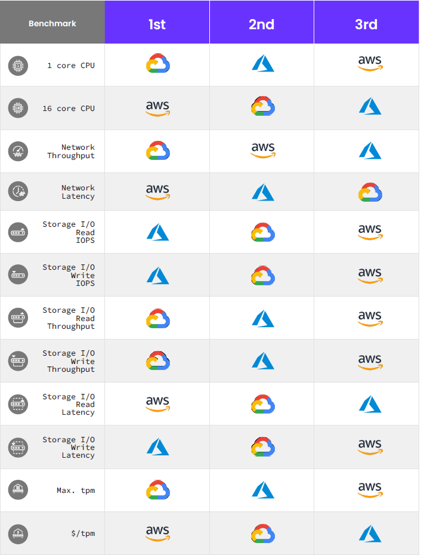
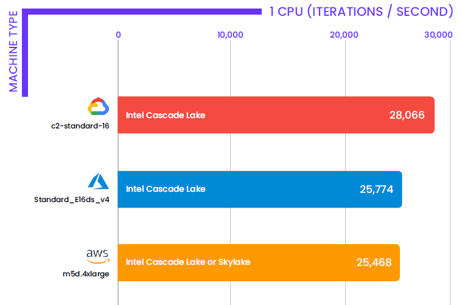
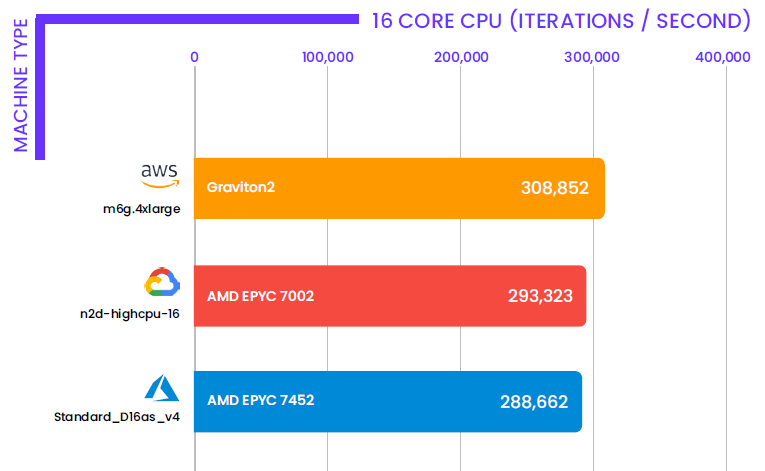
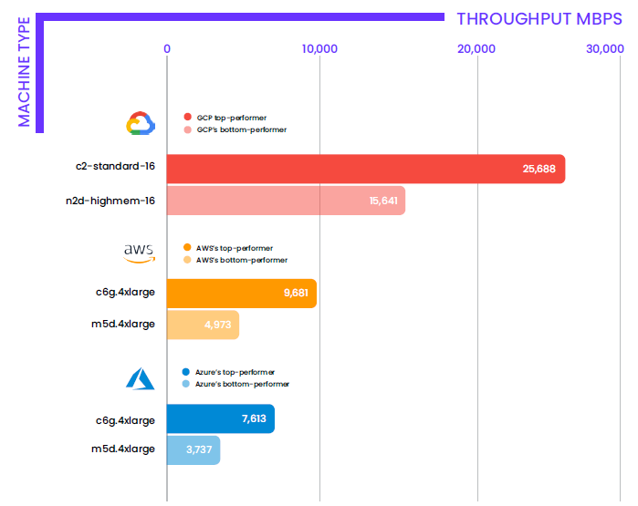
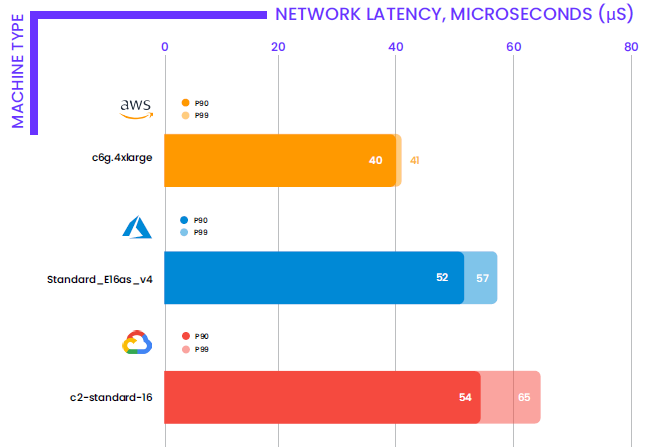
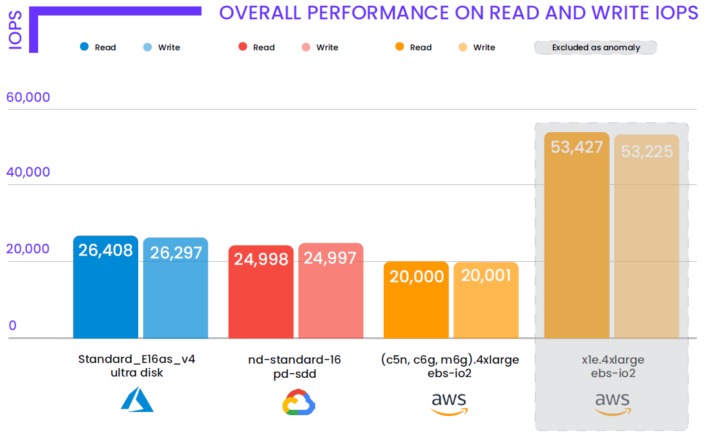
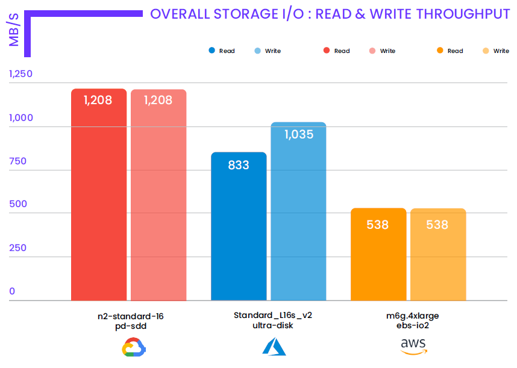
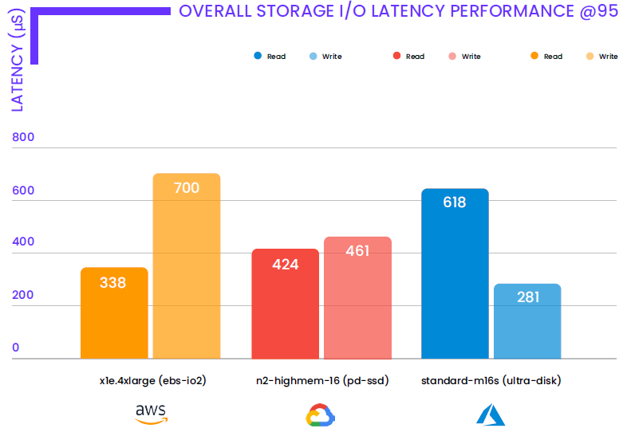
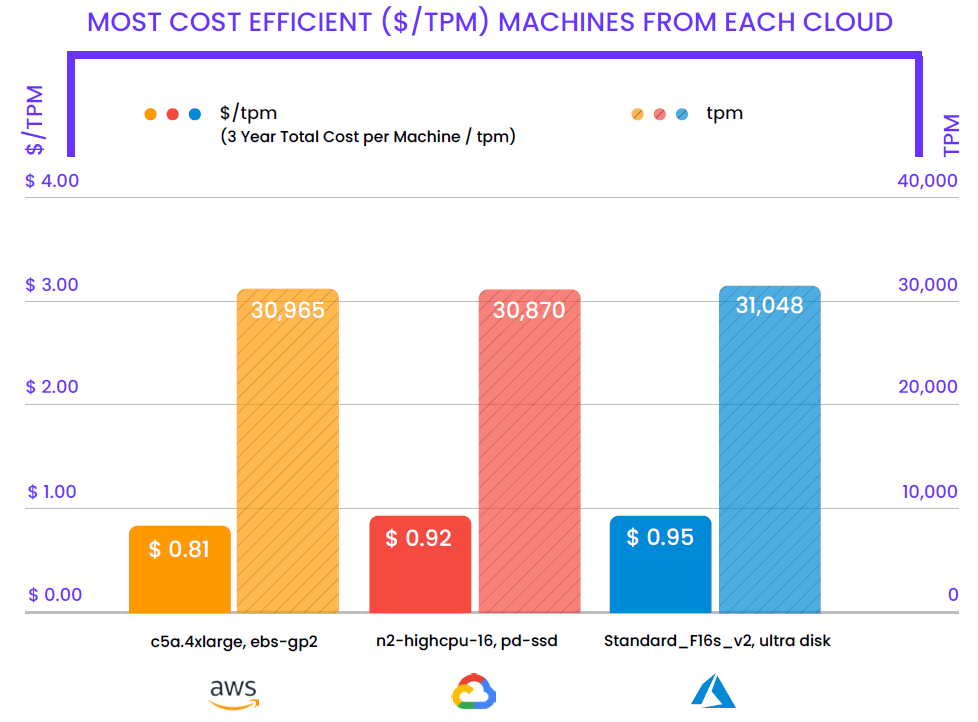
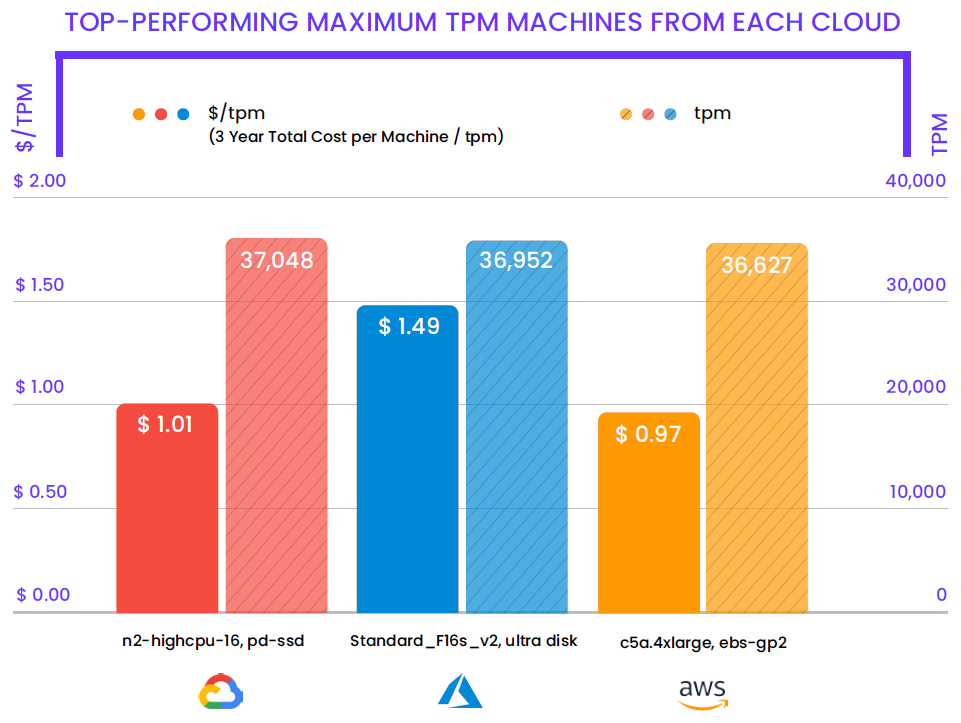

Each year, **Cockroach Labs** (The company, known for its open source **CockroachDB** that's described as a "SQL database for global cloud services") develops the only cloud performance report comparing the three largest Cloud providers ***AWS, Azure, and Google Cloud*** using industry-standard benchmarks that reflect real-world, critical applications and workloads.

For the [2021 Cloud Report](https://www.cockroachlabs.com/guides/2021-cloud-report){:target="_blank"}, Cockroach Labs ran over 1,000 tests to evaluate each provider on CPU, network throughput and latency, storage read/write performance, and the Cockroach Labs Derivative TPC-C database benchmark.

In this article, I will try to highlight some key takeaways from this report to help you find the right cloud provider and instances for your needs.

---
## Testing Methodologies & Benchmarks

For this report, Cockroach Labs assessed 54 machines and conducted nearly 1,000 benchmark runs to measure:

+ CPU Performance (CoreMark)
  
+ Network Performance (Netperf)

+ Storage I/O Performance (FIO)

+ OLTP Performance (Cockroach Labs Derivative of TPC-C)

---
## 2021 Cloud Report Results

>Now let’s try to look at each of these benchmarks in more depth.

1. **CPU Performance**
   
   - <u>GCP Produces Highest Single-Core Score</u>   
   GCP achieved the highest CoreMark score by 10% over best performing compute-optimized machines in AWS and Azure.

    

   - <u>AWS Scales with Graviton2 Processor</u>   
   The AWS custom-built Graviton2 Processor, which uses a 64-bit ARM architecture, enabled the top-performing m6g.4xlarge machine to achieve better multi-CPU scaling than the other machines.

   

2. **Network Performance**

   - <u>GCP has nearly 3 times the throughput of AWS & Azure</u>   
   GCP’s top-performing machine had 165% and 237% more throughput than AWS and Azure respectively.

    

   - <u>AWS is unmatchable in Network Latency</u>   
   AWS's top-performing machine’s 99th percentile network latency was 28% and 37% lower than Azure and GCP, respectively.

    

3. **Storage & I/O Performance**

   - <u>GCP’s General Purpose Disk Performs on Par with More Expensive Offerings from AWS and Azure</u>   
   GCP’s top-performing machine (n2-standard-16 / pd-ssd) achieved only 5% fewer read IOPS than the top-performing Azure machine (Standard_E16as_v4 / ultra-disk) with the more expensive ultra disk.

    

   - <u>Even with Cheaper Storage, GCP Has More Read and Write Storage I/O Throughput than Azure and AWS</u>   
   GCP’s top-performer (n2-standard-16) achieved 45% and 125% more read throughput than Azure and AWS, respectively. In addition, GCP had 17% and 125% more write throughput than Azure and AWS, respectively. Regarding cost efficiency, GCP’s top-performing monthly machine cost was 80% and 12% less than Azure and AWS’ monthly machine costs, respectively.

    

   - <u>Storage I/O Read and Write Latency Performance Varied Among the Clouds</u>   

    

4. **OLTP Performance**

   - <u>Cost Efficient Compute- and Memory-Optimized Machines Thrive in OLTP Benchmark</u>   
   Running a simulation of real-world OLTP workloads, cheaper machines with general purpose disks won for both AWS and GCP.

    

    

---
## Key Takeaways

+ AWS Offers Cost Efficiency; Room For Improvement on Storage I/O. AWS has provided the lowest network latencies of any of the major clouds. 

+ Azure’s Ultra Disks Deliver on Storage IOPS & Throughput. Microsoft Azure surpassed both clouds in storage I/O performance 

+ GCP Beats Out AWS & Azure Overall, Shines on Raw Throughput as it has outperformed the other clouds on every throughput benchmark. 

---
## Conclusion

GCP had the best overall performance across the set of microbenchmarks and achieved the best raw throughput on the OLTP benchmark, Cockroach Labs Derivative TPC-C.

GCP also nearly tripled the performance of AWS and Azure clouds on network throughput. 

Each year there is an overall “**winner**” of the report based on the cloud’s ranking for each of the respective benchmarks.
For the first time in three years of putting together the Cloud Report, GCP came out on top. 

>If you want to run these benchmarks yourself, CockroachLabs have made everything required for reproduction — steps and resources, scripts, configurations, and instructions — available in an [open source repository](https://github.com/cockroachlabs/cloud-report-2021){:target="_blank"}. 

